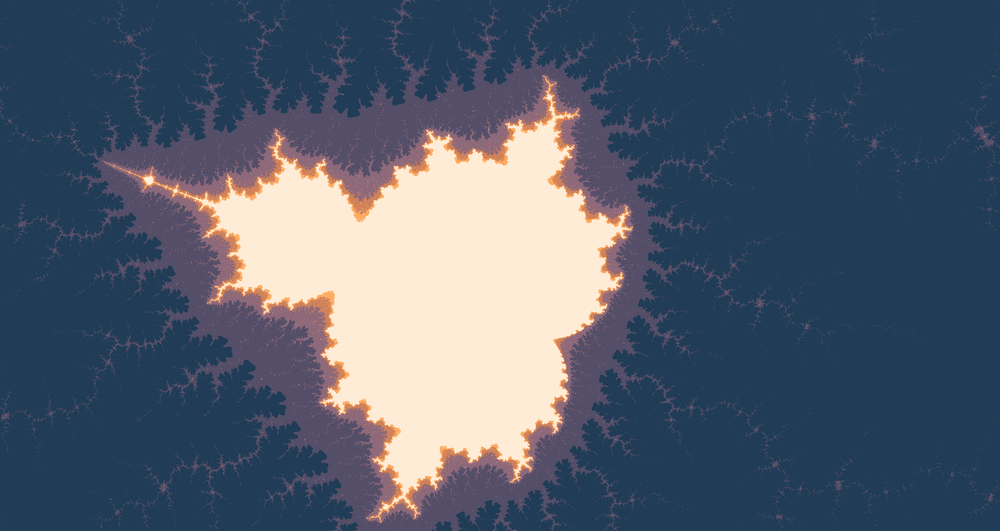
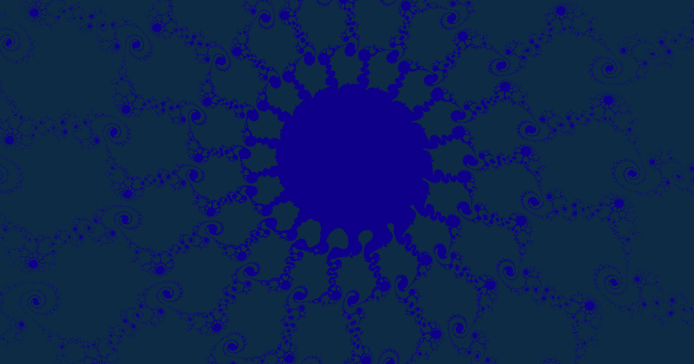
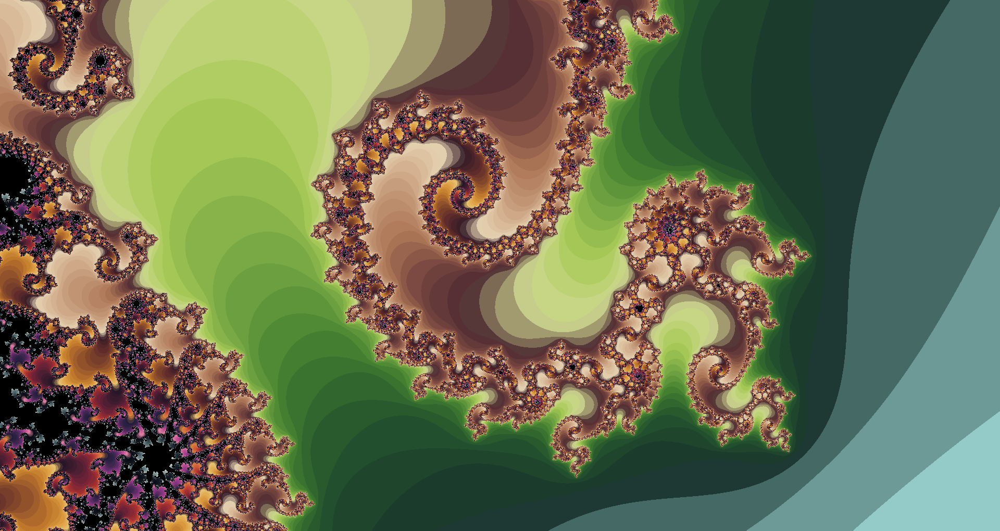

# mandelbrot-py

python (3.10.8)  
taichi (1.1.3)  
numpy (1.23.4)  

Made in Python using Taichi.

Uses your GPU unless it cannot find a suitable backend, then it will resort to using your CPU cores. The supported backends are CUDA, Vulkan, OpenGL, Metal, and DirectX 11.

Tested at 1920 x 1020 resolution. Please note that this resolution is not dynamic, so you would have to manually edit this yourself for different screen sizes. (It's just a value pair, the rest of the work is done for you.)

## Controls

z - zoom out, x - zoom in  
c - decrease focus, v - increase  
arrow keys to move  
r to set back defaults (go back to default view)  
e to toggle color interpolation  
1, 2 - switch between the available palettes  
s to take a screenshot

Note that zooming increases/decreases focus by a fixed small value. You would not normally have to increase/decrease focus yourself as this is automatically scaled in proportion.

After a certain max threshold, focus will no longer be automatically increased to conserve performance. You can override this using the corresponding button.

## Screenshots

## Palettes

SLSO8 by Luis Miguel Maldonado  
https://lospec.com/palette-list/slso8

Apollo by Adam C Younis  
https://lospec.com/palette-list/apollo
